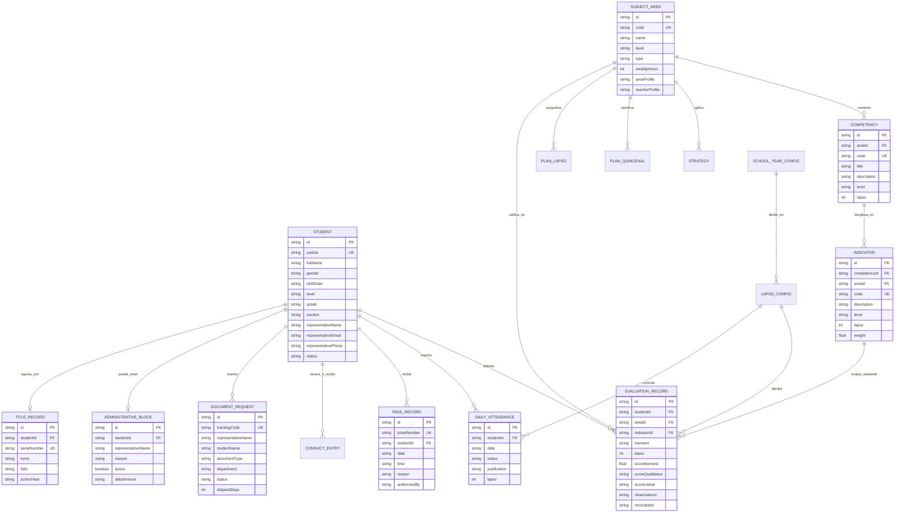

# 🗄️ Diccionario de Base de Datos y Modelo de Datos — SICE-CBA
**Sistema Integral de Control y Evaluación • U.E.P. Colegio Bellas Artes**  
*Código DEA: S0432D2305 • Año Escolar: 2026 - 2027 • Maracaibo, Estado Zulia, Venezuela*

---

## 📑 Tabla de Contenidos
1. [Arquitectura y Motor de Persistencia](#1-arquitectura-y-motor-de-persistencia)
2. [Diagrama Entidad-Relación (Mermaid ERD)](#2-diagrama-entidad-relación-mermaid-erd)
3. [Catálogo y Diccionario Detallado de Tablas](#3-catálogo-y-diccionario-detallado-de-tablas)
   - [3.1 `students` (Padrón Estudiantil)](#31-students-padrón-estudiantil)
   - [3.2 `subject_areas` (Malla Curricular / Asignaturas)](#32-subject_areas-malla-curricular--asignaturas)
   - [3.3 `competencies` (Banco de Competencias)](#33-competencies-banco-de-competencias)
   - [3.4 `indicators` (Indicadores de Logro y Ponderaciones)](#34-indicators-indicadores-de-logro-y-ponderaciones)
   - [3.5 `strategies` (Estrategias Pedagógicas y Didácticas)](#35-strategies-estrategias-pedagógicas-y-didácticas)
   - [3.6 `biweekly_plans` (Planes Quincenales de Aula)](#36-biweekly_plans-planes-quincenales-de-aula)
   - [3.7 `lapso_plans` (Planes Trimestrales de Lapso)](#37-lapso_plans-planes-trimestrales-de-lapso)
   - [3.8 `evaluation_records` (Calificaciones y Evaluaciones Procesales)](#38-evaluation_records-calificaciones-y-evaluaciones-procesales)
   - [3.9 `daily_attendance` (Asistencia Diaria de Aula)](#39-daily_attendance-asistencia-diaria-de-aula)
   - [3.10 `accumulated_attendance` (Inasistencias Acumuladas por Materia)](#310-accumulated_attendance-inasistencias-acumuladas-por-materia)
   - [3.11 `pass_records` (Pases de Retraso y Portería)](#311-pass_records-pases-de-retraso-y-portería)
   - [3.12 `conduct_entries` (Expediente de Convivencia y Disciplina)](#312-conduct_entries-expediente-de-convivencia-y-disciplina)
   - [3.13 `document_requests` (Trámites y Secretaría Escolar - SLA)](#313-document_requests-trámites-y-secretaría-escolar---sla)
   - [3.14 `administrative_blocks` (Control de Cobranza y Solvencia)](#314-administrative_blocks-control-de-cobranza-y-solvencia)
   - [3.15 `title_records` (Títulos de Bachiller y Calibración Ministerial)](#315-title_records-títulos-de-bachiller-y-calibración-ministerial)
   - [3.16 `school_year_config` (Periodos Lectivos y Lapsos)](#316-school_year_config-periodos-lectivos-y-lapsos)
   - [3.17 `community_notices` (Cartelera Informativa y Comunicados)](#317-community_notices-cartelera-informativa-y-comunicados)
   - [3.18 `system_notifications` (Centro de Notificaciones Omnicanal)](#318-system_notifications-centro-de-notificaciones-omnicanal)
4. [Reglas de Negocio Institucionales](#4-reglas-de-negocio-institucionales)
5. [Escalas de Calificación Oficiales MPPE / CBA](#5-escalas-de-calificación-oficiales-mppe--cba)
6. [Consultas Típicas del Sistema (SQL Equivalente)](#6-consultas-típicas-del-sistema-sql-equivalente)

---

## 1. Arquitectura y Motor de Persistencia

SICE-CBA implementa un modelo de datos estructurado y relacional con tipado estricto en TypeScript.

- **Capa de Almacenamiento**: LocalStorage del Navegador (`window.localStorage`) con hidratación reactiva vía React Context (`AppContext.tsx`).
- **Respaldo y Estado Inicial**: Dataset maestro en memoria (`src/data/seedData.ts`) precargado con la nómina real simulada del Colegio Bellas Artes.
- **Sincronización Multi-Pestaña**: Control de eventos `storage` y actualización reactiva inmediata en toda la suite.
- **Formato de Serialización**: JSON UTF-8 con claves foráneas cruzadas e integridad referencial lógica.

---

## 2. Diagrama Entidad-Relación (Mermaid ERD)



---

## 3. Catálogo y Diccionario Detallado de Tablas

### 3.1 `students` (Padrón Estudiantil)
**Propósito**: Almacena el censo oficial de estudiantes matriculados en los tres niveles del plantel (Inicial, Primaria, Media General), con vinculación legal a su representante.

| Campo | Tipo | Nulo | Descripción | Ejemplo / Restricción |
|---|---|---|---|---|
| `id` | `VARCHAR(36)` | NO | Identificador único (UUID) | `"stu-mg-1"` |
| `cedula` | `VARCHAR(20)` | NO | Cédula de identidad o escolar | `"V-32.901.442"` |
| `fullName` | `VARCHAR(150)` | NO | Nombres y apellidos completos | `"Camila Valentina Chacín Rivas"` |
| `gender` | `ENUM('M','F')` | NO | Género del estudiante | `'F'` |
| `birthDate` | `DATE` | NO | Fecha de nacimiento (ISO 8601) | `"2010-04-14"` |
| `level` | `ENUM` | NO | Nivel educativo | `'INICIAL'`, `'PRIMARIA'`, `'MEDIA_GENERAL'` |
| `grade` | `VARCHAR(30)` | NO | Grado o año en curso | `"4to Año"`, `"2do Grado"`, `"Sala 4 Años"` |
| `section` | `VARCHAR(5)` | NO | Sección asignada | `"A"`, `"B"`, `"C"` |
| `representativeName` | `VARCHAR(150)` | NO | Nombre del representante legal | `"Dra. Mariana Rivas de Chacín"` |
| `representativeEmail` | `VARCHAR(120)` | NO | Correo electrónico de contacto | `"m.rivas@clinicafalcon.com"` |
| `representativePhone` | `VARCHAR(30)` | NO | Teléfono móvil o WhatsApp | `"+58 414-6338901"` |
| `status` | `ENUM` | NO | Condición de prosecución | `'REGULAR'`, `'EN_REVISION'`, `'MATERIA_PENDIENTE'` |
| `pendingSubjects` | `TEXT[]` | SÍ | Array de materias pendientes | `["Física 3er Año"]` |
| `avatarUrl` | `VARCHAR(255)` | SÍ | URL de foto del estudiante | `"https://images.unsplash.com/..."` |

---

### 3.2 `subject_areas` (Malla Curricular / Asignaturas)
**Propósito**: Define las materias y asignaturas de cada nivel, su carga horaria semanal y el perfil pedagógico exigido al docente.

| Campo | Tipo | Nulo | Descripción | Ejemplo |
|---|---|---|---|---|
| `id` | `VARCHAR(36)` | NO | Identificador único | `"mg-mat"` |
| `code` | `VARCHAR(20)` | NO | Código ministerial o interno | `"MG-MAT-04"` |
| `name` | `VARCHAR(100)` | NO | Nombre de la asignatura | `"Matemáticas"` |
| `level` | `ENUM` | NO | Nivel educativo | `'MEDIA_GENERAL'` |
| `type` | `ENUM` | NO | Tipo de asignatura | `'REGULAR'`, `'INTEGRADA'`, `'ESPECIALIZADA'` |
| `areaProfile` | `TEXT` | NO | Alcance formativo del área | `"Pensamiento lógico-deductivo, álgebra..."` |
| `teacherProfile` | `TEXT` | NO | Perfil docente exigido | `"Licenciado en Educación mención Matemáticas..."` |
| `weeklyHours` | `INT` | NO | Horas de clase semanales | `5` |
| `iconName` | `VARCHAR(30)` | NO | Identificador de icono Lucide | `"Calculator"`, `"Bot"`, `"BookOpen"` |

---

### 3.3 `competencies` (Banco de Competencias)
**Propósito**: Repositorio de competencias curriculares organizadas por lapso y asignatura.

| Campo | Tipo | Nulo | Descripción | Ejemplo |
|---|---|---|---|---|
| `id` | `VARCHAR(36)` | NO | Clave primaria | `"comp-mat-1"` |
| `areaId` | `VARCHAR(36)` | NO | FK hacia `subject_areas.id` | `"mg-mat"` |
| `code` | `VARCHAR(20)` | NO | Código de la competencia | `"C-MAT-01"` |
| `title` | `VARCHAR(150)` | NO | Título sintético | `"Modelado y resolución de funciones algebraicas"` |
| `description` | `TEXT` | NO | Redacción formal de la competencia | `"Aplica métodos analíticos y representaciones gráficas..."` |
| `level` | `ENUM` | NO | Nivel educativo | `'MEDIA_GENERAL'` |
| `lapso` | `TINYINT` | NO | Lapso académico | `1`, `2`, `3` |

---

### 3.4 `indicators` (Indicadores de Logro y Ponderaciones)
**Propósito**: Desglose observable de cada competencia utilizado para asentar calificaciones procesales.

| Campo | Tipo | Nulo | Descripción | Ejemplo |
|---|---|---|---|---|
| `id` | `VARCHAR(36)` | NO | Clave primaria | `"ind-mat-1-1"` |
| `competencyId` | `VARCHAR(36)` | NO | FK hacia `competencies.id` | `"comp-mat-1"` |
| `areaId` | `VARCHAR(36)` | NO | FK hacia `subject_areas.id` | `"mg-mat"` |
| `code` | `VARCHAR(20)` | NO | Código del indicador | `"IND-01.1"` |
| `description` | `TEXT` | NO | Criterio de desempeño observable | `"Determina dominio y rango de funciones cuadráticas"` |
| `level` | `ENUM` | NO | Nivel educativo | `'MEDIA_GENERAL'` |
| `lapso` | `TINYINT` | NO | Lapso académico | `1` |
| `weight` | `FLOAT` | SÍ | Ponderación porcentual (Media Gral.) | `25.0` (25%) |
| `evaluationInstrument` | `VARCHAR(60)` | SÍ | Instrumento de recolección | `"Prueba Escrita Individual"`, `"Rúbrica"` |

---

### 3.5 `strategies` (Estrategias Pedagógicas y Didácticas)
**Propósito**: Catálogo de estrategias de enseñanza y evaluación disponibles para la planificación quincenal.

| Campo | Tipo | Nulo | Descripción | Ejemplo |
|---|---|---|---|---|
| `id` | `VARCHAR(36)` | NO | Clave primaria | `"strat-1"` |
| `areaId` | `VARCHAR(36)` | NO | FK hacia `subject_areas.id` | `"mg-mat"` |
| `name` | `VARCHAR(100)` | NO | Nombre de la estrategia | `"Resolución guiada de problemas en pizarra"` |
| `type` | `ENUM` | NO | Finalidad didáctica | `'ENSENANZA'`, `'EVALUACION'` |
| `category` | `VARCHAR(50)` | NO | Fase de la sesión | `"Desarrollo"`, `"Inicio"`, `"Digital / Robótica"` |
| `description` | `TEXT` | NO | Instrucción metodológica | `"Modelado de ejercicios paso a paso..."` |
| `resources` | `VARCHAR(150)` | NO | Recursos requeridos | `"Pizarra interactiva, calculadora científica"` |
| `level` | `ENUM` | NO | Nivel educativo | `'MEDIA_GENERAL'` |

---

### 3.6 `biweekly_plans` (Planes Quincenales de Aula)
**Propósito**: Unidades de planificación pedagógica quincenal presentadas por el docente para revisión de coordinación.

| Campo | Tipo | Nulo | Descripción | Ejemplo |
|---|---|---|---|---|
| `id` | `VARCHAR(36)` | NO | Clave primaria | `"plan-q-mat-1"` |
| `areaId` | `VARCHAR(36)` | NO | FK hacia `subject_areas.id` | `"mg-mat"` |
| `level` | `ENUM` | NO | Nivel pedagógico | `'MEDIA_GENERAL'` |
| `gradeSection` | `VARCHAR(30)` | NO | Grado y sección | `"4to Año A"` |
| `lapso` | `TINYINT` | NO | Lapso del año escolar | `1` |
| `startDate` | `DATE` | NO | Fecha de inicio de la quincena | `"2026-10-01"` |
| `endDate` | `DATE` | NO | Fecha de cierre de la quincena | `"2026-10-15"` |
| `title` | `VARCHAR(150)` | NO | Tema o título de la unidad | `"Unidad 1: Funciones Cuadráticas y Parábolas"` |
| `status` | `ENUM` | NO | Estado de aprobación | `'BORRADOR'`, `'A_REVISION'`, `'DEFINITIVO'` |
| `competencyIds` | `TEXT[]` | NO | Array de FK hacia `competencies` | `["comp-mat-1"]` |
| `indicatorIds` | `TEXT[]` | NO | Array de FK hacia `indicators` | `["ind-mat-1-1", "ind-mat-1-2"]` |
| `pedagogicalActivities` | `TEXT` | NO | Descripción paso a paso de sesiones | `"Sesión 1: Inducción teórica..."` |
| `differentiationNotes` | `TEXT` | SÍ | Adecuaciones curriculares / NEE | `"Apoyo visual para estudiantes con déficit de atención"` |
| `reviewFeedback` | `TEXT` | SÍ | Comentarios de la coordinación | `"Aprobado sin observaciones"` |
| `updatedAt` | `TIMESTAMP` | NO | Última modificación | `"2026-10-02T14:30:00Z"` |

---

### 3.7 `lapso_plans` (Planes Trimestrales de Lapso)
**Propósito**: Cronograma macro de evaluaciones y ponderaciones para todo el lapso académico.

| Campo | Tipo | Nulo | Descripción | Ejemplo |
|---|---|---|---|---|
| `id` | `VARCHAR(36)` | NO | Clave primaria | `"plan-l-mat-1"` |
| `areaId` | `VARCHAR(36)` | NO | FK hacia `subject_areas.id` | `"mg-mat"` |
| `level` | `ENUM` | NO | Nivel | `'MEDIA_GENERAL'` |
| `gradeSection` | `VARCHAR(30)` | NO | Curso | `"4to Año A"` |
| `lapso` | `TINYINT` | NO | Lapso | `1` |
| `status` | `ENUM` | NO | Estatus del plan | `'DEFINITIVO'` |
| `generalObjective` | `TEXT` | NO | Objetivo terminal del lapso | `"Dominar los fundamentos del análisis matemático..."` |
| `items` | `JSON[]` | NO | Lista de evaluaciones del lapso | `[ { title, weightPercent, instrument, scheduledDate } ]` |

---

### 3.8 `evaluation_records` (Calificaciones y Evaluaciones Procesales)
**Propósito**: Asiento individual de notas, literales y logros cualitativos por estudiante, área y lapso.

| Campo | Tipo | Nulo | Descripción | Ejemplo |
|---|---|---|---|---|
| `id` | `VARCHAR(36)` | NO | Clave primaria | `"eval-001"` |
| `studentId` | `VARCHAR(36)` | NO | FK hacia `students.id` | `"stu-mg-1"` |
| `areaId` | `VARCHAR(36)` | NO | FK hacia `subject_areas.id` | `"mg-mat"` |
| `indicatorId` | `VARCHAR(36)` | SÍ | FK hacia `indicators.id` | `"ind-mat-1-1"` |
| `moment` | `ENUM` | NO | Momento evaluativo | `'DIAGNOSTICA'`, `'PROCESAL'`, `'FINAL_LAPSO'` |
| `lapso` | `TINYINT` | NO | Lapso | `1` |
| `scoreNumeric` | `TINYINT` | SÍ | Nota en escala 01 a 20 (Media General) | `18` |
| `scoreQualitative` | `ENUM` | SÍ | Escala Inicial (`'C'`, `'EP'`, `'I'`) | `'C'` (Consolidado) |
| `scoreLiteral` | `ENUM` | SÍ | Escala Primaria (`'A'`, `'B'`, `'C'`, `'D'`, `'E'`) | `'A'` |
| `roboticsScore` | `JSON` | SÍ | Desglose de robótica educativa | `{ logicSkills: 'C', constructionSkills: 'C', teamwork: 'C' }` |
| `observations` | `TEXT` | SÍ | Observación cualitativa del docente | `"Excelente dominio en cálculo analítico."` |
| `recordedAt` | `TIMESTAMP` | NO | Fecha y hora del registro | `"2026-10-15T09:45:00Z"` |
| `teacherId` | `VARCHAR(36)` | NO | Identificador del docente calificador | `"doc-rivas"` |

---

### 3.9 `daily_attendance` (Asistencia Diaria de Aula)
**Propósito**: Registro de asistencia jornada por jornada para el control disciplinario y cálculo de porcentajes reglamentarios.

| Campo | Tipo | Nulo | Descripción | Ejemplo |
|---|---|---|---|---|
| `id` | `VARCHAR(36)` | NO | Clave primaria | `"att-d-001"` |
| `studentId` | `VARCHAR(36)` | NO | FK hacia `students.id` | `"stu-mg-1"` |
| `studentName` | `VARCHAR(150)` | NO | Nombre del alumno (desnormalizado para reporte rápido) | `"Camila Chacín"` |
| `gradeSection` | `VARCHAR(30)` | NO | Sección | `"4to Año A"` |
| `date` | `DATE` | NO | Fecha de la jornada | `"2026-10-14"` |
| `status` | `ENUM` | NO | Estado de asistencia | `'PRESENTE'`, `'INASISTENCIA_JUSTIFICADA'`, `'INASISTENCIA_INJUSTIFICADA'`, `'RETRASO'` |
| `justification` | `TEXT` | SÍ | Motivo de inasistencia o justificativo médico | `"Cita médica odontológica programada"` |
| `lapso` | `TINYINT` | NO | Lapso académico | `1` |

---

### 3.10 `accumulated_attendance` (Inasistencias Acumuladas por Materia)
**Propósito**: Consolida las clases dictadas y faltas acumuladas para validar la **regla reglamentaria del 25% de inasistencias**.

| Campo | Tipo | Nulo | Descripción | Ejemplo |
|---|---|---|---|---|
| `id` | `VARCHAR(36)` | NO | Clave primaria | `"att-acc-1"` |
| `studentId` | `VARCHAR(36)` | NO | FK hacia `students.id` | `"stu-mg-1"` |
| `areaId` | `VARCHAR(36)` | NO | FK hacia `subject_areas.id` | `"mg-mat"` |
| `areaName` | `VARCHAR(100)` | NO | Nombre de la asignatura | `"Matemáticas"` |
| `lapso` | `TINYINT` | NO | Lapso | `1` |
| `totalClasses` | `INT` | NO | Clases impartidas en el lapso | `40` |
| `unjustifiedAbsences` | `INT` | NO | Inasistencias no justificadas | `3` |
| `justifiedAbsences` | `INT` | NO | Inasistencias con justificativo | `1` |
| `absencePercentage` | `FLOAT` | NO | `%` = `(unjustified / totalClasses) * 100` | `7.5` (7.5%) |
| `exceedsLimit` | `BOOLEAN` | NO | `TRUE` si `absencePercentage > 25.0` | `false` |

---

### 3.11 `pass_records` (Pases de Retraso y Portería)
**Propósito**: Registro de pases de entrada tardía emitidos en la recepción/portería con talonario imprimible.

| Campo | Tipo | Nulo | Descripción | Ejemplo |
|---|---|---|---|---|
| `id` | `VARCHAR(36)` | NO | Clave primaria | `"pass-101"` |
| `ticketNumber` | `VARCHAR(20)` | NO | Número de boleto/talonario único | `"P-2026-084"` |
| `studentId` | `VARCHAR(36)` | NO | FK hacia `students.id` | `"stu-mg-2"` |
| `studentName` | `VARCHAR(150)` | NO | Nombre del alumno | `"Diego Alejandro Romero"` |
| `gradeSection` | `VARCHAR(30)` | NO | Curso | `"4to Año A"` |
| `date` | `DATE` | NO | Fecha de emisión | `"2026-10-15"` |
| `time` | `VARCHAR(15)` | NO | Hora de ingreso | `"07:35 AM"` |
| `reason` | `VARCHAR(150)` | NO | Causa del retraso | `"Fuerte congestión vehicular en Av. Bella Vista"` |
| `authorizedBy` | `VARCHAR(100)` | NO | Funcionario de guardia | `"Prof. Marcos Andrade (Docente de Guardia)"` |
| `printed` | `BOOLEAN` | NO | Bandera de impresión oficial | `true` |

---

### 3.12 `conduct_entries` (Expediente de Convivencia y Disciplina)
**Propósito**: Bitácora de incidencias disciplinarias, llamados de atención, acuerdos con representantes y reconocimientos positivos.

| Campo | Tipo | Nulo | Descripción | Ejemplo |
|---|---|---|---|---|
| `id` | `VARCHAR(36)` | NO | Clave primaria | `"cond-01"` |
| `studentId` | `VARCHAR(36)` | NO | FK hacia `students.id` | `"stu-mg-2"` |
| `studentName` | `VARCHAR(150)` | NO | Nombre del estudiante | `"Diego Alejandro Romero"` |
| `gradeSection` | `VARCHAR(30)` | NO | Curso | `"4to Año A"` |
| `date` | `DATE` | NO | Fecha del suceso | `"2026-10-10"` |
| `lapso` | `TINYINT` | NO | Lapso | `1` |
| `type` | `ENUM` | NO | Tipificación según acuerdo de convivencia | `'POSITIVA'`, `'LEVE'`, `'GRAVE'`, `'MUY_GRAVE'` |
| `description` | `TEXT` | NO | Relato detallado de los hechos | `"Uso no autorizado de teléfono celular durante la clase..."` |
| `agreements` | `TEXT` | NO | Compromisos acordados con el alumno | `"El alumno entrega el dispositivo al iniciar la jornada..."` |
| `reportedBy` | `VARCHAR(100)` | NO | Docente o coordinador actuante | `"Prof. Alejandro Rivas"` |

---

### 3.13 `document_requests` (Trámites y Secretaría Escolar - SLA)
**Propósito**: Gestión del ciclo de vida de emisión de documentos oficiales y control de días de espera (SLA).

| Campo | Tipo | Nulo | Descripción | Ejemplo |
|---|---|---|---|---|
| `id` | `VARCHAR(36)` | NO | Clave primaria | `"doc-req-01"` |
| `trackingCode` | `VARCHAR(20)` | NO | Código alfanumérico de seguimiento | `"CBA-DOC-2026-0042"` |
| `representativeName` | `VARCHAR(150)` | NO | Representante solicitante | `"Ing. Carlos Urdaneta"` |
| `studentName` | `VARCHAR(150)` | NO | Estudiante | `"Sebastián Urdaneta"` |
| `gradeSection` | `VARCHAR(30)` | NO | Curso | `"2do Grado B"` |
| `documentType` | `ENUM` | NO | Tipo de trámite | `'Constancia de Estudio'`, `'Notas Certificadas'`, `'Carta de Buena Conducta'`, `'Solvencia Administrativa'`, `'Certificación de Título'` |
| `department` | `ENUM` | NO | Departamento ejecutor | `'Control de Estudios'`, `'Administración'`, `'Dirección'` |
| `requestDate` | `DATE` | NO | Fecha de radicación | `"2026-10-08"` |
| `elapsedDays` | `INT` | NO | Días hábiles transcurridos (SLA) | `4` |
| `status` | `ENUM` | NO | Estado del trámite | `'PENDIENTE'`, `'EN_TRAMITE'`, `'LISTO_ENTREGA'`, `'ENTREGADO'` |
| `notes` | `TEXT` | SÍ | Observaciones de entrega | `"Entregado con firma del representante"` |

---

### 3.14 `administrative_blocks` (Control de Cobranza y Solvencia)
**Propósito**: Registro de suspensiones temporales de acceso a notas y emisión de constancias por morosidad o recaudos pendientes.

| Campo | Tipo | Nulo | Descripción | Ejemplo |
|---|---|---|---|---|
| `id` | `VARCHAR(36)` | NO | Clave primaria | `"blk-01"` |
| `representativeId` | `VARCHAR(36)` | NO | Cédula o ID del representante | `"V-15.890.312"` |
| `representativeName` | `VARCHAR(150)` | NO | Nombre del representante | `"Lic. Gustavo Adolfo Perozo"` |
| `studentId` | `VARCHAR(36)` | NO | FK hacia `students.id` | `"stu-mg-4"` |
| `studentName` | `VARCHAR(150)` | NO | Nombre del alumno | `"Valeria Sofía Perozo"` |
| `gradeSection` | `VARCHAR(30)` | NO | Sección | `"4to Año B"` |
| `reason` | `VARCHAR(200)` | NO | Motivo del bloqueo | `"Mora mayor a 60 días en mensualidades escolares"` |
| `blockDate` | `DATE` | NO | Fecha de aplicación | `"2026-10-01"` |
| `active` | `BOOLEAN` | NO | `true` = Bloqueado, `false` = Solvente | `true` |
| `debtAmount` | `VARCHAR(30)` | SÍ | Monto de compromiso pendiente | `"$180.00 USD"` |

---

### 3.15 `title_records` (Títulos de Bachiller y Calibración Ministerial)
**Propósito**: Control de seriales únicos de papel moneda ministerial, registro de tomo y folio para egresados de 5to año.

| Campo | Tipo | Nulo | Descripción | Ejemplo |
|---|---|---|---|---|
| `id` | `VARCHAR(36)` | NO | Clave primaria | `"tit-01"` |
| `studentId` | `VARCHAR(36)` | NO | FK hacia `students.id` | `"stu-5to-01"` |
| `studentName` | `VARCHAR(150)` | NO | Nombre del graduando | `"Alejandro José Morales Prieto"` |
| `cedula` | `VARCHAR(20)` | NO | Cédula de identidad | `"V-31.450.881"` |
| `schoolYear` | `VARCHAR(15)` | NO | Año lectivo de egreso | `"2026-2027"` |
| `graduationYear` | `VARCHAR(4)` | NO | Año civil de graduación | `"2027"` |
| `serialNumber` | `VARCHAR(30)` | NO | Serial del papel de seguridad | `"MPPE-2027-CBA-001248"` |
| `tomo` | `VARCHAR(10)` | NO | Tomo de registro en libro | `"XLII"` |
| `folio` | `VARCHAR(10)` | NO | Folio de asiento | `"154"` |
| `registeredCode` | `VARCHAR(40)` | NO | Código de registro de títulos | `"ZUL-MPPE-0432-2027"` |
| `calibrated` | `BOOLEAN` | NO | Margen de impresión calibrado | `true` |

---

### 3.16 `school_year_config` (Periodos Lectivos y Lapsos)
**Propósito**: Configuración central del calendario institucional y regla de bloqueo de notas.

| Campo | Tipo | Nulo | Descripción | Ejemplo |
|---|---|---|---|---|
| `year` | `VARCHAR(15)` | NO | Periodo lectivo | `"2026-2027"` |
| `isCurrent` | `BOOLEAN` | NO | Periodo activo en el sistema | `true` |
| `lapsos` | `JSON[]` | NO | Array de los 3 lapsos académicos | Ver desglose inferior |

#### Desglose de cada Lapso (`lapsos[]`):
| Subcampo | Tipo | Descripción | Ejemplo |
|---|---|---|---|
| `lapso` | `1 \| 2 \| 3` | Número de lapso | `1` |
| `name` | `VARCHAR(50)` | Denominación formal | `"Primer Lapso Pedagógico"` |
| `startDate` | `DATE` | Fecha de apertura | `"2026-09-15"` |
| `endDate` | `DATE` | Fecha de culminación | `"2026-12-18"` |
| `isGradingOpen` | `BOOLEAN` | **Regla de negocio**: habilita/bloquea carga de notas a docentes | `true` (abierto) / `false` (bloqueado) |

---

### 3.17 `community_notices` (Cartelera Informativa y Comunicados)
**Propósito**: Avisos y circulares emitidas por la Dirección o Coordinación a la comunidad escolar.

| Campo | Tipo | Nulo | Descripción | Ejemplo |
|---|---|---|---|---|
| `id` | `VARCHAR(36)` | NO | Clave primaria | `"notif-cba-1"` |
| `title` | `VARCHAR(150)` | NO | Título de la noticia | `"Apertura de Nuevos Laboratorios STEAM"` |
| `content` | `TEXT` | NO | Contenido completo del comunicado | `"Nos complace anunciar la dotación de los sets modulares..."` |
| `date` | `VARCHAR(20)` | NO | Fecha de publicación | `"15/09/2026"` |
| `type` | `ENUM` | NO | Categoría | `'NOTICIA'`, `'ANUNCIO_URGENTE'`, `'EVENTO'` |
| `targetAudience` | `ENUM` | NO | Destinatarios | `'TODOS'`, `'DOCENTES'`, `'REPRESENTANTES'`, `'ESTUDIANTES'` |
| `author` | `VARCHAR(100)` | NO | Emisor institucional | `"Dirección General CBA"` |
| `pinned` | `BOOLEAN` | SÍ | Noticia fijada al inicio | `true` |

---

### 3.18 `system_notifications` (Centro de Notificaciones Omnicanal)
**Propósito**: Cola interactiva de notificaciones en tiempo real con despacho omnicanal (Portal, Email y WhatsApp).

| Campo | Tipo | Nulo | Descripción | Ejemplo |
|---|---|---|---|---|
| `id` | `VARCHAR(36)` | NO | Clave primaria | `"sys-notif-1"` |
| `title` | `VARCHAR(120)` | NO | Encabezado | `"Calificaciones Publicadas: Matemáticas"` |
| `message` | `TEXT` | NO | Cuerpo del mensaje | `"El Prof. Rivas ha asentado las notas procesales..."` |
| `timestamp` | `VARCHAR(30)` | NO | Momento de emisión | `"Hace 5 minutos"` |
| `read` | `BOOLEAN` | NO | Estado de lectura | `false` |
| `category` | `ENUM` | NO | Categoría temática | `'CALIFICACIONES'`, `'ASISTENCIA'`, `'DOCUMENTOS'`, `'INSTITUCIONAL'`, `'SISTEMA'` |
| `priority` | `ENUM` | NO | Nivel de urgencia | `'BAJA'`, `'MEDIA'`, `'ALTA'` |
| `recipientRole` | `ENUM` | NO | Rol destinatario | `'REPRESENTANTE'`, `'ESTUDIANTE'`, `'DOCENTE'`, `'TODOS'` |
| `deliveryChannels` | `ENUM[]` | NO | Canales despachados | `['PORTAL', 'EMAIL', 'SMS_WHATSAPP']` |

---

## 4. Reglas de Negocio Institucionales

### RN-01: Ventana de Carga de Notas y Bloqueo Temporal
- **Condición**: Si `schoolYearConfig.lapsos[lapso].isGradingOpen === false`:
- **Efecto**: Los docentes tienen **bloqueada la edición** de planillas, cuadernos procesales y cierres de lapso.
- **Mensaje Oficial al Usuario**:
  > `⛔ "No existen lapsos habilitados para la carga de registros."`

### RN-02: Límite del 25% de Inasistencias Injustificadas
- **Condición**: En `accumulated_attendance`, si `(unjustifiedAbsences / totalClasses) > 0.25`:
- **Efecto**: La condición del estudiante cambia automáticamente a `EXCEDE_LIMITE (25%)`, emitiendo una alerta al Coordinador y condicionando la aprobación de la asignatura según el Reglamento de Evaluación del Colegio Bellas Artes.

### RN-03: Restricción por Bloqueo Administrativo
- **Condición**: Si `administrative_blocks.active === true` para un alumno:
- **Efecto**: Queda inhabilitada la descarga de boletines, sábanas de rendimiento y emisión de constancias de estudio en línea hasta que la administración registre la solvencia.

### RN-04: Notificación Omnicanal al Publicar Notas
- **Condición**: Cuando un docente presiona "Publicar Calificaciones":
- **Efecto**: Se despachan automáticamente notificaciones a la bandeja web del estudiante, correo del representante y mensaje SMS/WhatsApp con los canales seleccionados.

---

## 5. Escalas de Calificación Oficiales MPPE / CBA

```
┌─────────────────┬───────────────────┬───────────────────────────────────────────┐
│ Nivel Educativo │ Escala Oficial    │ Valores y Rangos                          │
├─────────────────┼───────────────────┼───────────────────────────────────────────┤
│ Educación       │ Cualitativa       │ • C  = Consolidado                        │
│ Inicial         │ Descriptiva       │ • EP = En Proceso                         │
│                 │                   │ • I  = Iniciado                           │
├─────────────────┼───────────────────┼───────────────────────────────────────────┤
│ Educación       │ Literal           │ • A  = Excelente (Alcanzó todos los obj)  │
│ Primaria        │ Alfabética (A-E)  │ • B  = Muy Bien (Alcanzó la mayoría)      │
│                 │                   │ • C  = Bien (Alcanzó los esenciales)      │
│                 │                   │ • D  = Regular (Dificultades en algunos)  │
│                 │                   │ • E  = No alcanzó las competencias mínimas│
├─────────────────┼───────────────────┼───────────────────────────────────────────┤
│ Media           │ Numérica          │ • 18 a 20 = Sobresaliente                 │
│ General         │ Vigesimal (01-20) │ • 15 a 17 = Muy Bueno                     │
│                 │                   │ • 10 a 14 = Aprobado (Mínimo: 10)         │
│                 │                   │ • 01 a 09 = Aplazado / En Riesgo          │
└─────────────────┴───────────────────┴───────────────────────────────────────────┘
```

---

## 6. Consultas Típicas del Sistema (SQL Equivalente)

### Consulta 1: Sábana de Notas Consolidada del Lapso 1 (Media General)
```sql
SELECT 
    s.cedula,
    s.fullName AS estudiante,
    s.grade,
    s.section,
    ROUND(AVG(e.scoreNumeric), 2) AS promedio_lapso,
    CASE 
        WHEN AVG(e.scoreNumeric) >= 10 THEN 'APROBADO'
        ELSE 'EN RIESGO'
    END AS condicion
FROM students s
JOIN evaluation_records e ON s.id = e.studentId
WHERE s.level = 'MEDIA_GENERAL' 
  AND e.lapso = 1
GROUP BY s.id, s.cedula, s.fullName, s.grade, s.section
ORDER BY s.grade, s.section, s.fullName ASC;
```

### Consulta 2: Estudiantes con Alerta de Inasistencia (> 25%)
```sql
SELECT 
    s.fullName AS estudiante,
    a.name AS asignatura,
    acc.totalClasses AS clases_dadas,
    acc.unjustifiedAbsences AS faltas_injustificadas,
    ROUND((acc.unjustifiedAbsences::FLOAT / acc.totalClasses) * 100, 1) AS porcentaje_faltas
FROM accumulated_attendance acc
JOIN students s ON acc.studentId = s.id
JOIN subject_areas a ON acc.areaId = a.id
WHERE acc.lapso = 1 
  AND (acc.unjustifiedAbsences::FLOAT / acc.totalClasses) > 0.25;
```

### Consulta 3: Trámites de Secretaría Vencidos (SLA > 3 Días)
```sql
SELECT 
    trackingCode,
    studentName,
    documentType,
    department,
    requestDate,
    elapsedDays
FROM document_requests
WHERE status IN ('PENDIENTE', 'EN_TRAMITE')
  AND elapsedDays >= 3
ORDER BY elapsedDays DESC;
```

---
*Documento generado para el repositorio oficial SISCEBA • U.E.P. Colegio Bellas Artes*
